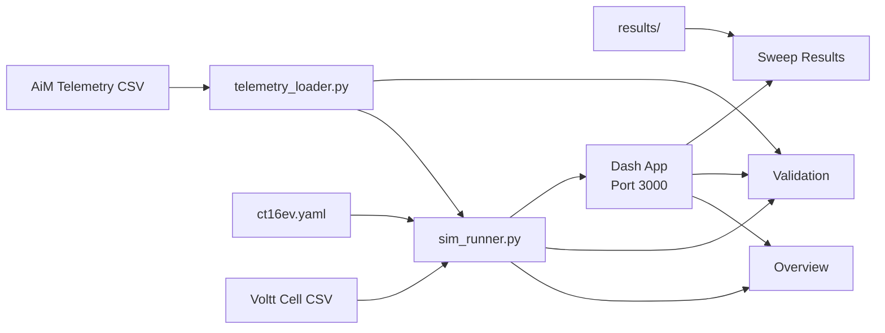

# Dashboard

> [!success] Status: Functional (3 pages with real data)

**Source:** `dashboard/`

---

## Architecture



The dashboard runs a baseline simulation on first load (cached in memory) and displays results. Validation compares sim output against real AiM telemetry.

---

## Pages

| Page | Path | Purpose | Data Source |
|------|------|---------|-------------|
| **Simulation Overview** | `/` | Sim results + FSAE scoring | Baseline sim (ReplayStrategy, 22 laps) |
| **Validation** | `/validation` | Sim vs telemetry comparison | Sim result + AiM CSV |
| **Sweep Results** | `/sweeps` | Parameter sweep visualization | `results/` directory (Phase 3) |

---

## Data Layer

| Module | Purpose |
|--------|---------|
| `dashboard/data/telemetry_loader.py` | Loads and caches AiM CSV, detects laps |
| `dashboard/data/sim_runner.py` | Runs baseline sim, computes scoring and validation |

---

## Running the Dashboard

```bash
# Via Docker
docker-compose up

# Or directly
python -m dashboard
```

Runs on **port 3000** with Dash debug mode enabled. First load takes ~2s to run the baseline simulation.

See also: [[Getting Started]], [[Roadmap]]
